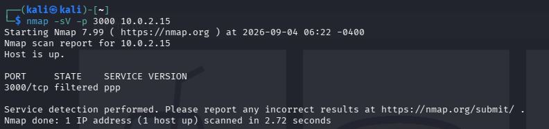
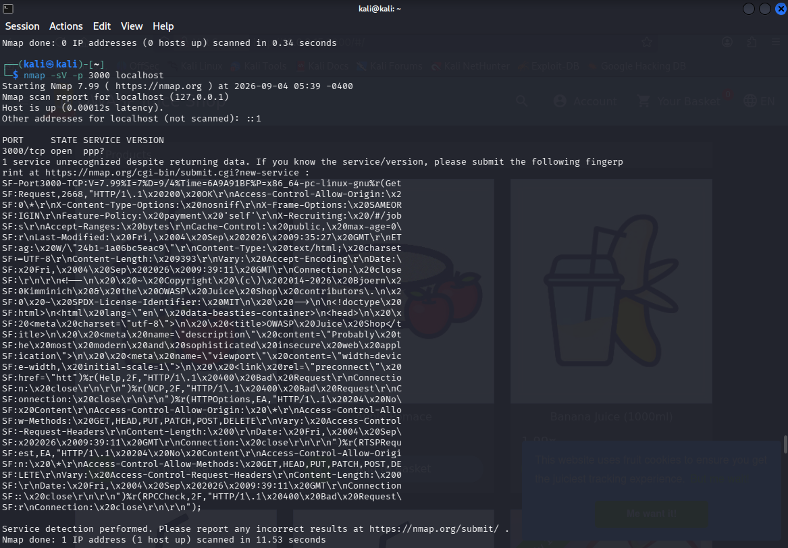
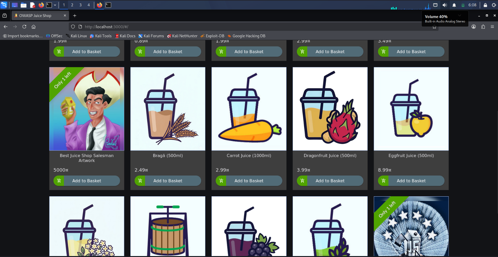

# Laporan Baseline Recon — Bab 1

## 1. Scope & Tujuan
- **Target**: 3000
- **Jaringan**: Host-only / internal, terisolasi dari internet
- **Tujuan**: Latihan baseline reconnaissance & pembiasaan dokumentasi
- **Tanggal**: 4 September 2026
- **Dilakukan oleh**: Jonathan Steven Tjahjaputra

## 2. Ringkasan Eksekutif
"Dilakukan pemindaian awal terhadap satu aplikasi latihan untuk memetakan layanan yang berjalan. Ditemukan satu layanan web aktif dengan versi framework yang teridentifikasi."

## 3. Metodologi & Tools
| Tool | Versi | Fungsi |
|---|---|---|
| Nmap | 7.99 | Port & service scanning |
| Kali Linux | 2026.1 | Sistem operasi attacker |

## 4. Temuan

### Temuan #1 — Port Web Terbuka Tanpa Pembatasan
- **Deskripsi**: Port 3000/tcp pada target terbuka dan menjalankan aplikasi web OWASP Juice Shop, membuat aksesnya tidak terbatasi.
- **Bukti**:

    

    Versi Scan Log Mentah
    
    
- **Skor CVSS**: -
- **Rekomendasi**: Tutup akses port dengan autentikasi.

## 5. Lampiran
- Hasil `nmap`

    

- Halaman Target berhasil di akses

    

- File log scan mentah

    