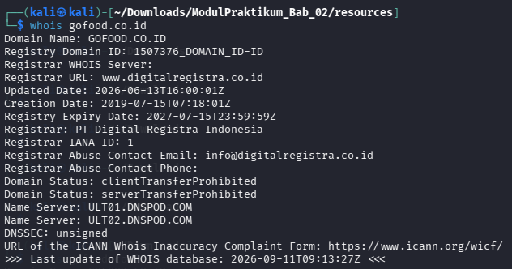
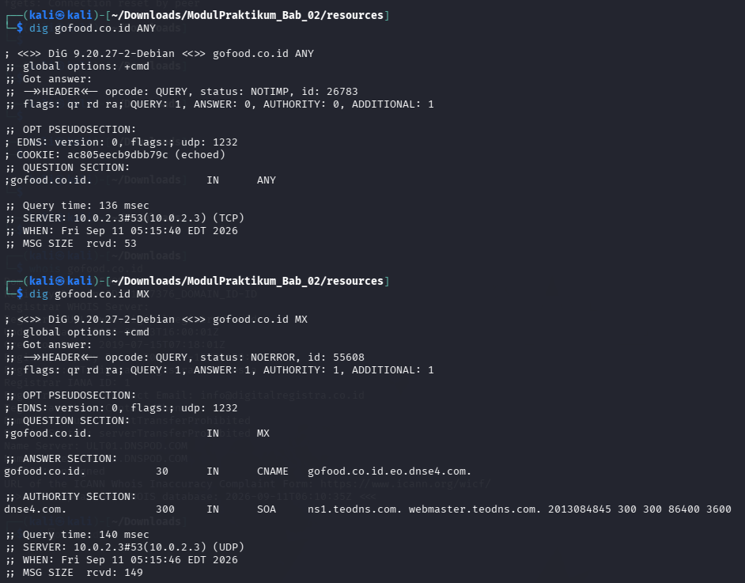
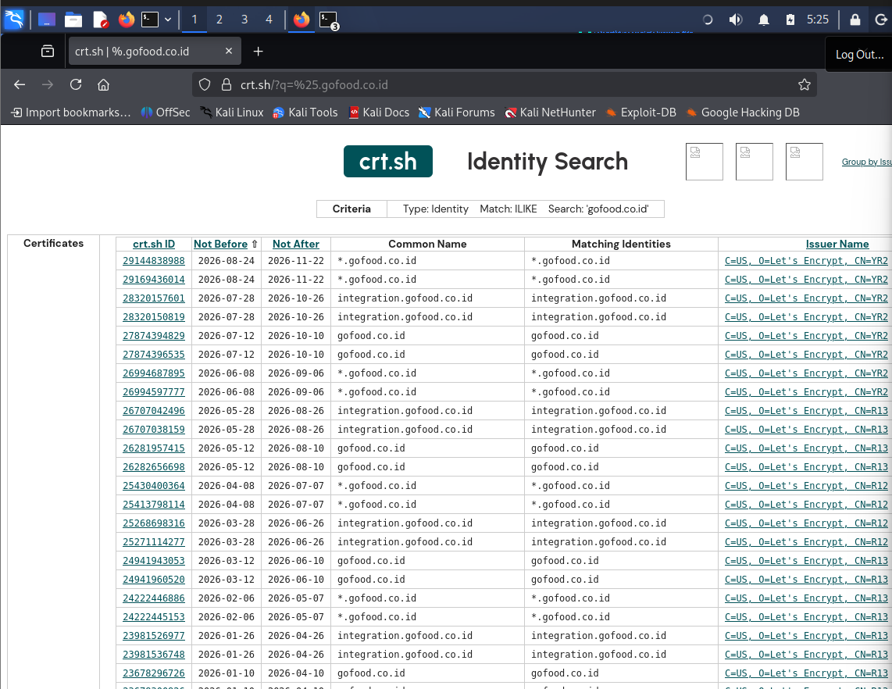
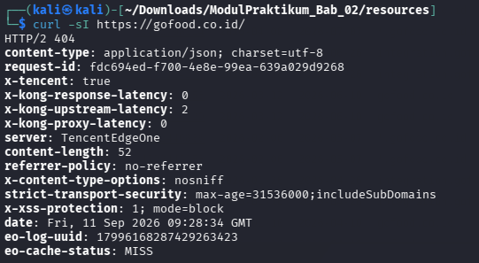
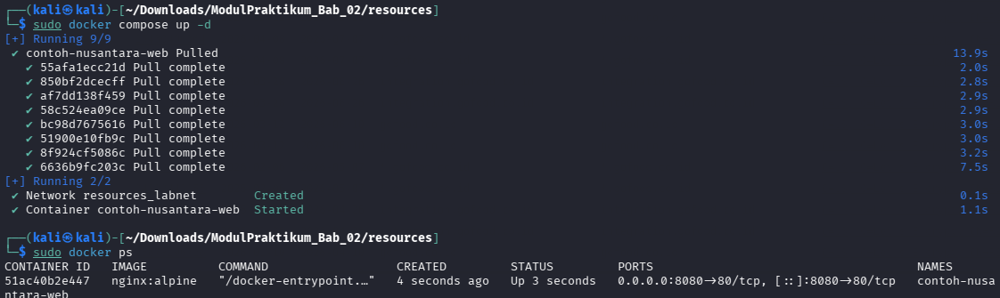
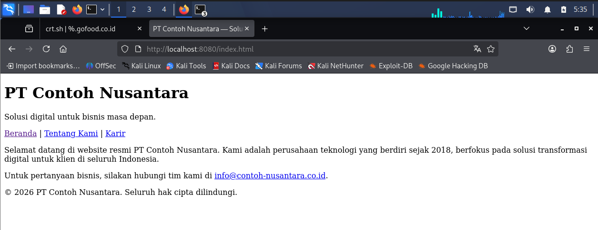
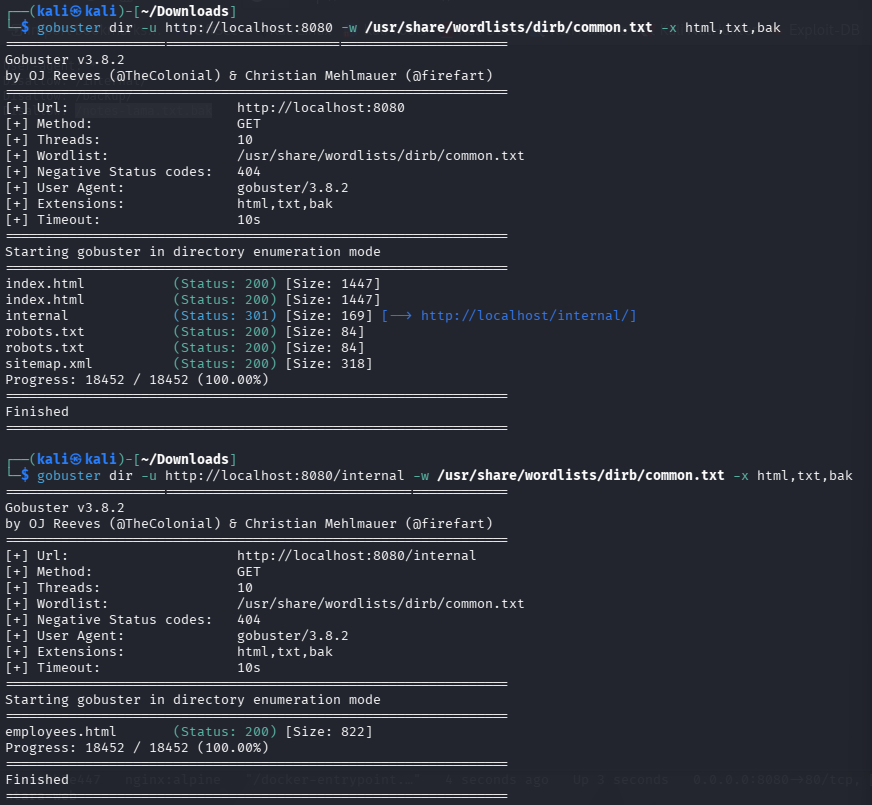
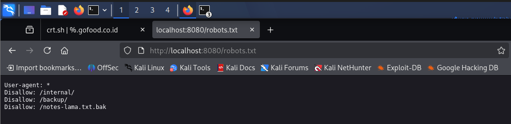
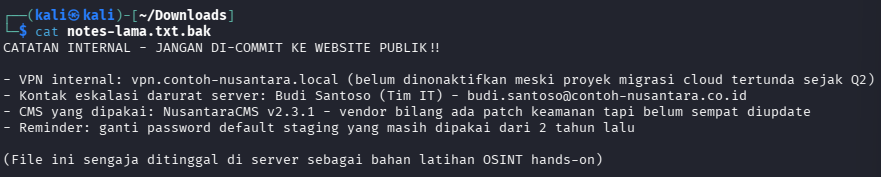
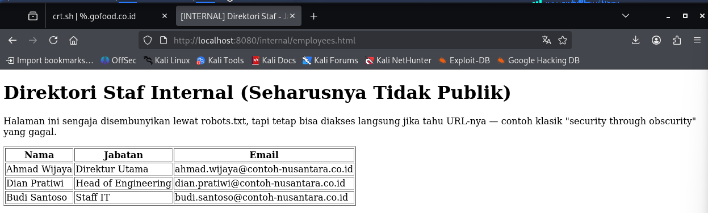

# Peta OSINT — Bab 2

## Identitas Penulis Laporan
- **Nama**: Jonathan Steven Tjahjaputra
- **NRP**: 5027251036

## Identitas Target
- **Nama domain/organisasi**: GOFOOD.CO.ID
- **Alasan target ini sah untuk diriset**: Program Bug Bounty oleh YesWeHack
- **Tanggal riset**: Jum'at, 11 September 2026

## Bagian A — Riset Terhadap Sumber Publik

### Info Registrasi (WHOIS)
- Registrar: PT Registra Digital Indonesia
- Tanggal registrasi: 2019-07-15T07:18:01Z
- Nama server: ULT01.DNSPOD.COM ; ULT02.DNSPOD.COM

### Subdomain Ditemukan (crt.sh, theHarvester, dsb.)
| Subdomain | Sumber Penemuan | Catatan |
|---|---|---|
| integration.gofood.co.id | crt.sh | Tercatat pada sertifikat |
| gerakanorangtuaasuh.gofood.co.id | crt.sh | Tercatat pada sertifikat |
| alpha.gofood.co.id | crt.sh | Tercatat pada sertifikat |
| v0.gofood.co.id | crt.sh | Muncul sebagai SAN pada sertifikat |
| *.gofood.co.id | crt.sh | Wildcard certificate dan tidak menunjukkan subdomain spesifik |

### Email & Pola Format Email
- Contoh email ditemukan: -
- Pola format yang diduga: -

### Teknologi Terdeteksi
- Web server / CMS: TencentEdgeOne
- CDN / layanan pihak ketiga (dari CSP header, dsb.): HTTP/2 404

### Perangkat/Service Menarik dari Shodan/Censys
- Tidak ada

## Bagian B — Hands-On Kode Sumber & Halaman Web (PT Contoh Nusantara)

| Temuan | Lokasi (URL/File) | Informasi yang Bocor | Potensi Dampak |
|---|---|---|---|
| file txt | http://localhost:8080/notes-lama.txt.bak | Rekap penggunaan layanan eksternal | Pihak yang melihat bisa memakai layanan-layanan tersebut |
| file txt | http://localhost:8080/robots.txt | Ekstensi file yang tersembunyi | Digunakan untuk menelurusi notes-lama serta folder internal |
| file xml | http://localhost:8080/sitemap.xml | Struktur website | - |
| file html | http://localhost:8080/internal/employees.html | Data email karyawan yang bekerja | Email bisa digunakan untuk kontak penipuan dan lain-lain |

## Ringkasan & Refleksi
> Hal yang paling mengejutkan bagi saya adalah seberapa mudahnya data bisa tersebar atau bocor hanya karena ketidaktelitian pembuat web. Yang paling saya takuti adalah data seperti e-mail ataupun rekap penggunaan layanan eksternal tadi.

## Lampiran
- Penelusuran dengan tools `whois`
    

- Penelusuran dengan tools `dig`
    

- Penelusuran dengan search `crt.sh`
    

- Penelusuran dengan tools `curlsi`
    

- Proses Start PT Contoh
    

- Tampilan PT Contoh
    

- Melihat semua URL yang tersedia dengan `gobuster`
    

- Menelusuri `robots.txt`
    

- Menelusuri `notes-lama.txt.bak` dengan command `cat`
    

- Menelusuri `employees.html` dari ekstensi `internal`
    