# KJK-PCAP-Traffic-Analysis

**KELOMPOK 6 KJK A**
| Nama | NRP |
| --- | --- |
| Jonathan Steven Tjahjaputra | 5027251**036** |
| Rido Patra Yudhistira Edwin | 5027251**120** |

Selengkapnya dapat dilihat pada Github berikut:
https://github.com/RiD0PatraYE06/KJK-PCAP-Traffic-Analysis
---
## Nomor 1 hingga 5 (Jonathan)
Saya hanya menggunakan AI untuk translate nomor 5 (Isi konten payload) pada link
https://share.gemini.google/TTVdtVy0eHec

### **1. What transport layer protocol is being used in the packet capture? (5 poin)**
* **Jawaban: `Transmission Control Protocol (TCP)`**

* **Display Filter: `tcp`**

* **Langkah-Langkah Pengerjaan:**

    1. Buka file `uo8dwp.pcapng` pada Wireshark
    2. Amati semua frame (Total ada sekitar 42)
    3. Perhatikan Header `Panel List` pada atribut `Protocol`, semua frame menggunakan `TCP`
    4. Untuk membuktikan lebih lanjut, Kita bisa expand bagian `IPv4` dan melihat protocolnya secara langsung. Atau bisa juga melalui header yang bernilai `06`
    5. Pada saat mengamati 3 frame awal, terjadi TCP 3-Way Handshake dimana secara berurutan, frame dikirimkan dengan info `SYN`, `SYN-ACK`, `ACK`.

* **Lampiran:**
    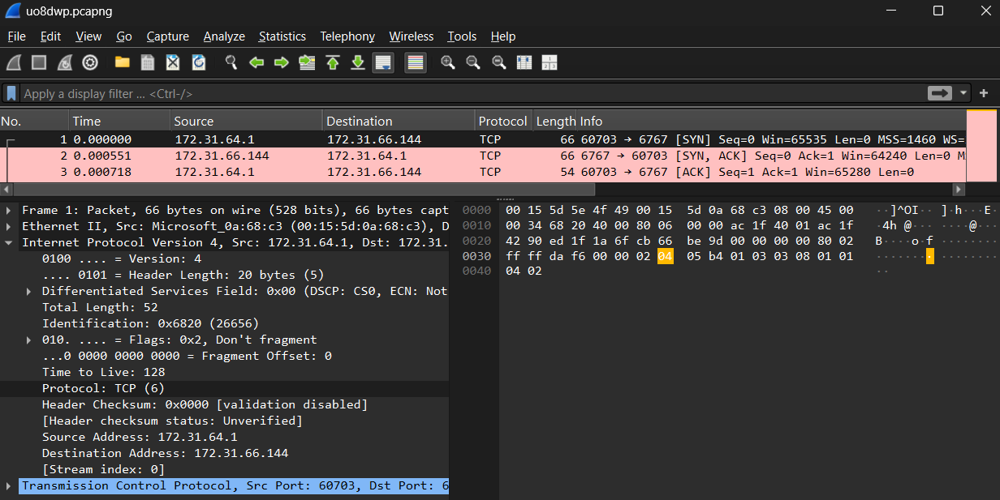

* **Teori & Penjelasan Singkat:**
    > Berdasarkan standar resmi IANA, nomor protokol 6 secara spesifik mengidentifikasikan TCP. Selain itu, Mekanisme connection-oriented seperti ini (3-Way Handshake) hanya ada pada TCP dan tidak ada pada protokol transport nir-koneksi (connectionless) seperti UDP.
---

### **2. Which IP address is the malware (client) in this communication, and how can you tell? (10 poin)**

* **Jawaban: `172.31.63.1` dengan ephemeral port `60703`**

* **Display Filter: `tcp.flags.syn == 1 and tcp.flags.ack == 0`**

* **Langkah-Langkah Pengerjaan:**

    1. Terapkan filter `tcp.flags.syn == 1 and tcp.flags.ack == 0` yang akan memunculkan frame 1.
    2. Expand `IPv4` dan dapat dilihat `Source Address: 172.31.63.1`.
    3. Expand juga `Transmission Control Protocol` dan dapat dilihat juga `Source Port: 60703`.

* **Lampiran:**
    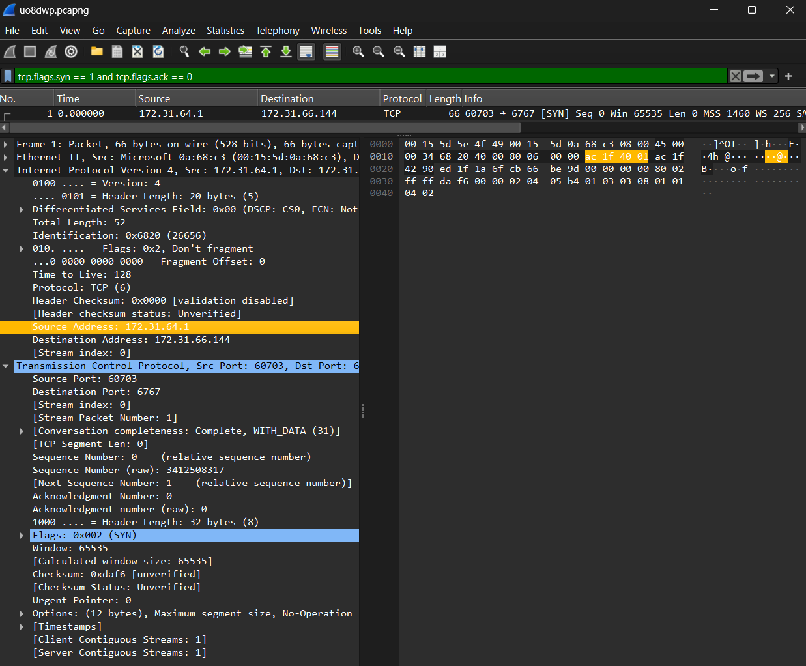

* **Teori & Penjelasan Singkat:**
    > Secara arsitektur jaringan TCP, Client didefinisikan sebagai pihak yang berinisiatif pertama kali mengetuk pintu server sebelum ada sesi apa pun.Karena belum ada data atau paket sebelumnya yang perlu dikonfirmasi/diterima oleh client, maka flag konfirmasi (ACK) pada paket pembuka tersebut bernilai 0. Dengan memastikan syn == 1 dan ack == 0, paket yang terjaring dijamin adalah paket pertama yang dikirim oleh inisiator/klien, sehingga dapat dideteksi asal usulnya.
---

### **3. Which IP address is the listener (server), and what port is it listening on? (10 poin)**

* **Jawaban: IPnya `172.31.66.144` dengan port listener `6767`**

* **Display Filter: `tcp.flags.syn == 1 and tcp.flags.ack == 0`**

* **Langkah-Langkah Pengerjaan:**

    1. Masih berada pada display filter yang sama, pilih frame 1.
    2. Pada ekspansi `IPv4` juga dapat dilihat adanya `Destination Address: 172.31.66.144`.
    3. Pada ekspansi `Transmission Control Protocol` juga terlihat ada `Destination Port: 6767`.

* **Lampiran:**
    

* **Teori & Penjelasan Singkat:**
    > Pada setiap paket IPv4 yang dikirimkan melalui jaringan, header IP selalu memuat dua informasi utama yaitu Source Address, Alamat host yang mengirim paket (172.31.63.1) dan Destination Address, Alamat host yang dituju atau pihak yang sedang mendengarkan/menunggu koneksi (172.31.66.144). Karena Frame 1 adalah paket inisiasi koneksi ([SYN]), penerima dari paket pembuka tersebut otomatis merupakan pihak listener (lebih tepatnya server). 


---

### **4. At what point in the trace does the malware send its first payload (encrypted data), and how can you identify it? (10 poin)**

* **Jawaban: Pada Frame 4**

* **Display Filter: `tcp.len > 0`**

* **Langkah-Langkah Pengerjaan:**

    1. Input filter `tcp.len > 0` pada Display Filter.
    2. Amati beberapa paket pertama yang muncul lalu lihat `Source Address` melalui ekspansi `IPv4`. Karena tampaknya keseluruhan paket berasal dari sumber yang sama, maka frame pertama yang muncul pada filter (Frame 4) adalah payload pertamanya.
    3. Hal ini secara lanjut dibuktikan dengan atribut `Info` yang menunjukkan `[PSH, ACK]`.
    4. Dan didukung lebih lanjut lagi dengan ekspansi pada `Transmission Control Protocol` yang menunjukkan adanya atribut `TCP Payload (36 bytes)` yang sebelumnya tidak muncul pada Frame 1, 2, dan 3.

* **Lampiran:**
    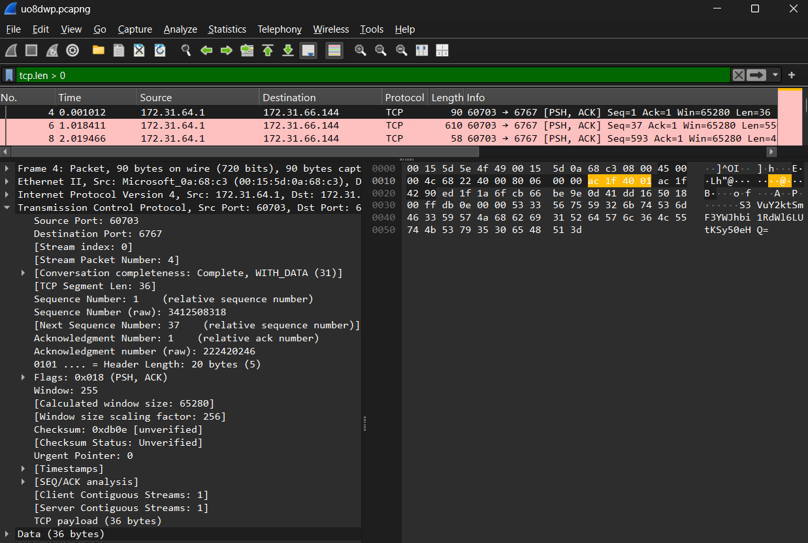

* **Teori & Penjelasan Singkat:**
    > Filter tcp.len > 0 digunakan untuk menyaring dan mengabaikan seluruh paket kendali kosong (seperti proses 3-way handshake pada Frame 1–3 yang berukuran 0 byte) agar Wireshark hanya menampilkan paket yang benar-benar membawa muatan data aplikasi pertama kali. Keberadaan baris TCP payload pada panel Packet Details menjadi bukti fisik bahwa paket tersebut membawa muatan nyata layer atas.

### **5. What are the contents of the payload sent by the malware? (15 poin)**

* **Jawaban: 5 file diantaranya-**
    1. `Kunci-Jawaban-Quiz-KJK.txt`
    2. `Nilai-Quiz-KJK.csv`
    3. `IMPORTANT_NOTES`
    4. `Bank-Soal-Quiz-KJK.txt`
    5. `CONFESSION`

* **Display Filter: `tcp`**

* **Langkah-Langkah Pengerjaan:**

    1. Ganti filter ke `tcp`
    2. Klik kanan salah satu frame dengan `info [PSH]`
    3. Pilih opsi `Follow TCP Stream`
    4. Enkode isi file menggunakan sumber apapun (Saya menggunakan Gemini AI supaya tidak perlu satu-satu copaste)
    5. Hasilnya, ada 5 file yang dikirimkan. Dapat dilihat pada folder `Src` di repo https://github.com/RiD0PatraYE06/KJK-PCAP-Traffic-Analysis

* **Lampiran:**
    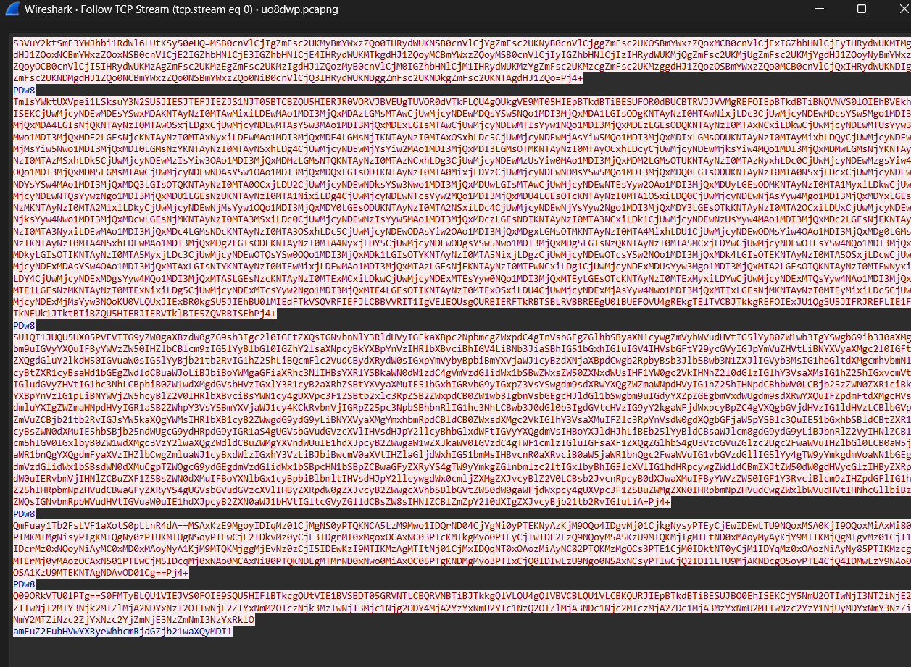

* **Teori & Penjelasan Singkat:**
    > Fitur Follow TCP Stream di Wireshark dapat menampilkan seluruh isi konten payload karena fitur ini secara otomatis merekonstruksi dan menyusun kembali (reassemble) pecahan-pecahan paket data TCP sesuai urutan nomor sequence-nya, membuang semua informasi header jaringan yang tidak perlu, dan menyajikan muatan data aplikasi tersebut secara utuh dalam format teks. Karena malware mentransfer datanya tanpa enkripsi kriptografis (seperti TLS/SSL) melainkan hanya disandikan menggunakan Base64 polos, Wireshark dapat langsung membaca dan menampilkan karakter teks ASCII Base64 tersebut bolak-balik sebagaimana aslinya.
---
## Nomor 6 hingga 10 (Rido)
Link penggunaan AI : https://share.gemini.google/TTVdtVy0eHec
(Dapat dilihat lognya pada Github)

### **6. What does the malware encode the data in before transferring? (5 poin)**

* **Jawaban:** **Base64**

* **Display Filter:** `ip.src == 172.31.64.1` ini adalah filter untuk melihat list trafic yg dikirim malware

* **Langkah-Langkah Pengerjaan:**
    1. Pilih paket TCP dari malware yang membawa *payload* data (bisa dilihat dari ukurannya yang besar, yaitu yang `length > 100`).
    2. Buka **Follow $\rightarrow$ TCP Stream** untuk melihat isi *payload*.
    3. Masukkan semua isi *payload* ke dalam `gchq.github.io/CyberChef`.
    4. Pakai `Entropy`

    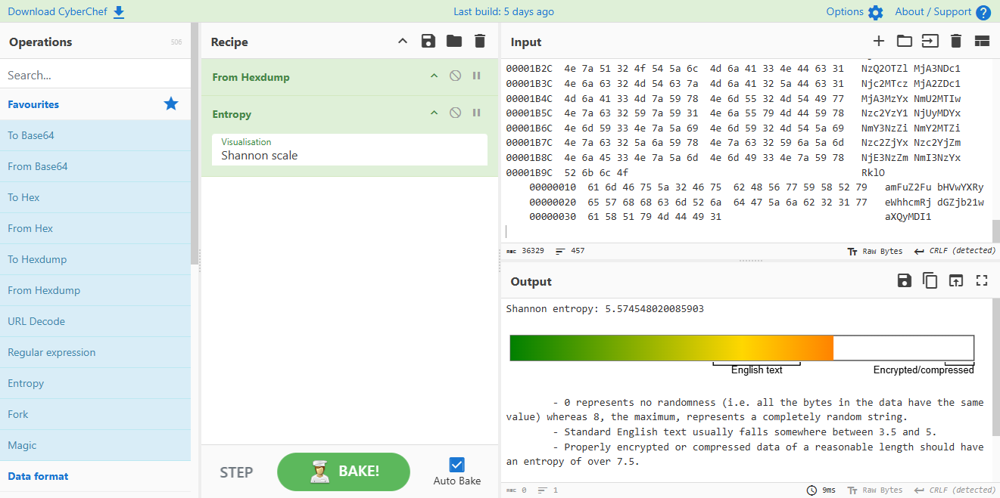

    5. Kita bisa lihat bahwa Entropy nya kurang dari 6, yang berarti enkripsi yang digunakan tidak terlalu acak.
    6. Lanjutkan dengan mencoba `Magic`.

    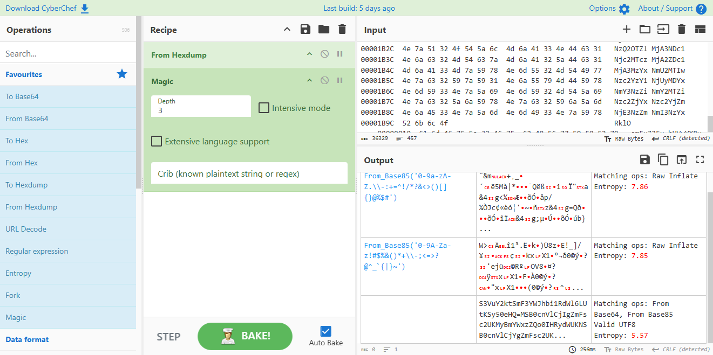

    7. Kita bisa lihat kalau kita bisa coba Base64 dan Base85
    8. Kita coba Base64 dulu (Base85 terlalu lemot).

    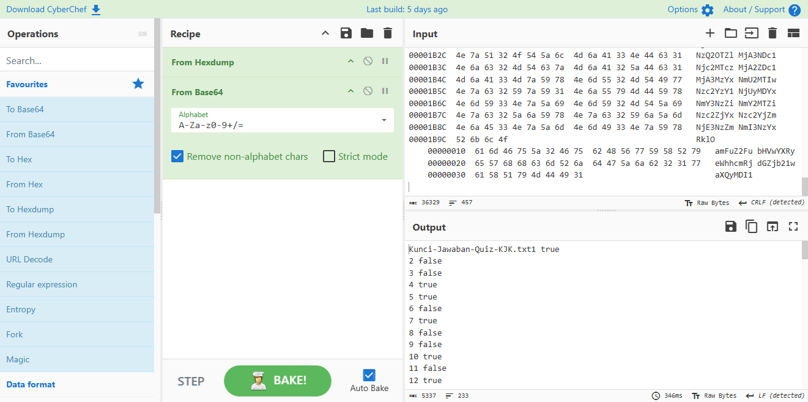

* **Teori & Penjelasan Singkat:**
    > Malware sering melakukan encode menggunakan **Base64** sebelum dikirim. Tujuannya untuk menjaga isi data agar tidak rusak oleh proses transmisi serta melakukan semacam enkripsi sederhana.

---

### **7. What is the name of the final file sent by the malware? (10 poin)**

* **Jawaban:** **`CONFESSION`**

* **Display Filter:** `frame.number == 32`

* **Langkah-Langkah Pengerjaan:**

    1. Amati urutan transmisi file pada jendela **Follow $\rightarrow$ TCP Stream** atau periksa paket-paket berkode `[PSH, ACK]` dari IP `10.0.2.15`.
    2. Malware mengirimkan nama file sebelum mengirimkan isi filenya. Urutan file yang dikirim adalah:
        * File 1: `Kunci-Jawaban-Quiz-KJK.txt` (Paket 4) `S3VuY2ktSmF3YWJhbi1RdWl6LUtKSy50eHQ`.
        * File 2: `Nilai-Quiz-KJK.csv` (Paket 11) `TmlsYWktUXVpei1LSksuY3N2`.
        * File 3: `IMPORTANT_NOTES` (Paket 18) `SU1QT1JUQU5UX05PVEVT`.
        * File 4: `Bank-Soal-Quiz-KJK.txt` (Paket 25) `QmFuay1Tb2FsLVF1aXotS0pLLnR4dA`.
        * File 5 (Terakhir): Paket ke-32 membawa *payload* `Q09ORkVTU0lPTg`.

    3. Dekode string Base64 `Q09ORkVTU0lPTg` menggunakan terminal atau decoder online:Q09ORkVTU0lPTg" | base64 -d
    ```
    Online Decoder
    
    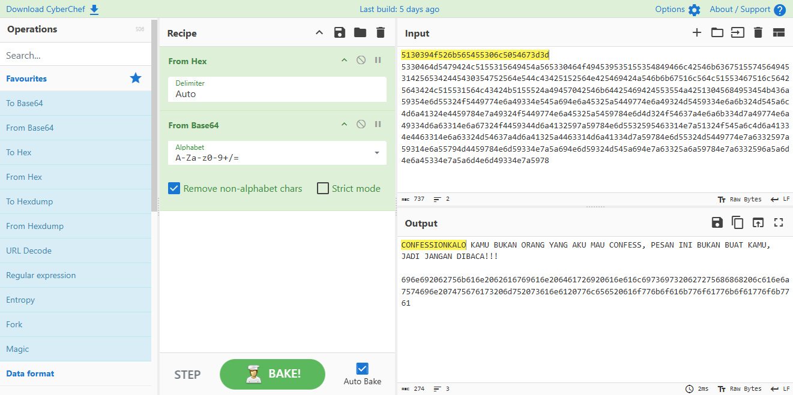

* **Teori & Penjelasan Singkat:**
    > Sebelum koneksi selesai dengan sinyal `FIN`, Paket frame ke-32 merupakan pengiriman nama file terakhir dari malware ke *listener*. String mentah Base64 `Q09ORkVTU0lPTg==` terdekode sempurna menjadi nama file **`CONFESSION`**.

---

### **8. What are the contents of the 3rd file sent by the malware? (10 poin)**

* **Jawaban:**
    * **Nama Berkas Ke-3:** `IMPORTANT_NOTES`
    * **Isi Berkas (Plaintext):** Lorem Ipsum.

* **Display Filter:** `frame.number == 18`

* **Langkah-Langkah Pengerjaan:**

    1. Identifikasi pengiriman nama file ke-3 pada Paket 16 (`IMPORTANT_NOTES`).
    2. Buka Paket ke-18 yang merupakan isi data dari file ke-3 tersebut.
    3. Ambil string Base64 dari Paket ke-18 (`TG9yZW0gaXBzdW0gZG9sb3Igc2l0IGFtZXQsIGNv...`).
    4. Dekode string tersebut ke format *plaintext*:
    ```text
    Lorem ipsum dolor sit amet, consectetur adipiscing elit. Nulla diam risus, fermentum nec tempor a, lobortis non erat. Praesent vel eros nec elit facilisis dapibus tempor a ex. Morbi a nulla in ex ullamcorper bibendum. Mauris sit amet tincidunt enim, nec commodo magna. Praesent rutrum, libero in faucibus suscipit, odio lorem posuere eros, maximus rhoncus metus ligula eget nibh. In hac habitasse platea dictumst. Vestibulum pellentesque, quam sed sagittis iaculis, magna lorem interdum massa, in tempus tellus lectus vitae mauris. Nulla dolor ligula, volutpat efficitur magna sit amet, consectetur dapibus mi. Maecenas eget tempor lacus. Quisque molestie velit tempor nulla pretium, non gravida neque volutpat. Vivamus pulvinar efficitur dui vehicula faucibus.

    Donec dignissim ante massa, porttitor tempus orci iaculis id. Ut lectus metus, eleifend commodo blandit ac, tempus vel tortor. Mauris blandit et tellus sed iaculis. Vestibulum ut lacinia est. Nullam et metus lectus. Nam congue porttitor dui. Pellentesque ultricies aliquam erat vel pharetra. Donec et libero tortor. Integer sed urna et leo tempus suscipit eget nec augue. Mauris vel imperdiet est. Mauris in aliquet diam. Suspendisse sapien velit, tincidunt at varius vel, finibus quis lacus. In pretium vehicula nunc, porttitor tincidunt sapien molestie nec. Morbi vehicula vestibulum luctus.

    Sed porta vestibulum ipsum id pharetra. Morbi dignissim leo a neque mattis, eget fermentum turpis pretium. Donec sed neque lectus. Phasellus in enim ultricies, ultrices eros eget, lobortis turpis. Praesent auctor eros vitae magna tincidunt pharetra. Pellentesque pretium eros vel quam elementum iaculis. Quisque nec est tincidunt, elementum sapien sed, condimentum enim. Mauris vestibulum imperdiet leo, sed efficitur eros commodo in. 
    ```

    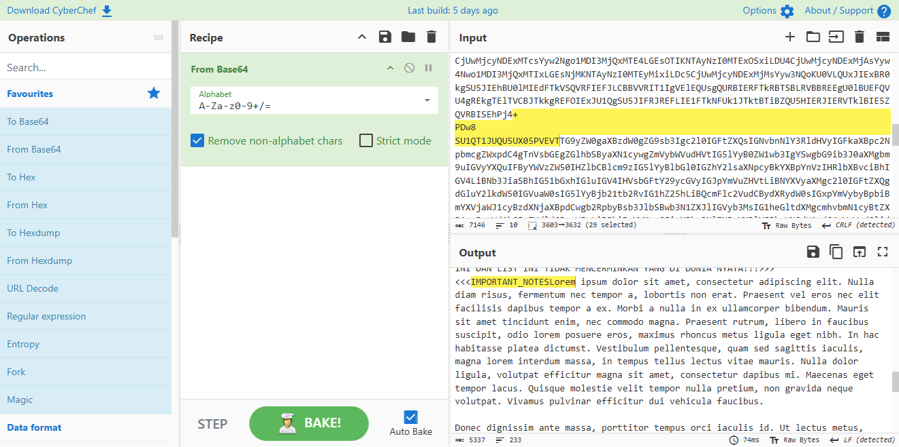

* **Teori & Penjelasan Singkat:**
    > Isi dari berkas ke-3 (`IMPORTANT_NOTES`) ada di paket frame ke-18 dalam bentuk encode Base64. Setelah didekode, isi file txt adalah Lorem Ipsum.

---

### **9. What are the status signal sent by the malware to the listener if it has NOT finished sending files? And whats the status signal if it is finished? (15 poin)**

* **Jawaban:**
    * **Sinyal Belum Selesai (NOT Finished):** `Pj4+` $\rightarrow$ **`>>>`**
    * **Sinyal Selesai (Finished):** `RklO` $\rightarrow$ **`FIN`**

* **Display Filter:** `frame.number == 8 || frame.number == 15 || frame.number == 22 || frame.number == 29`

* **Langkah-Langkah Pengerjaan:**
    1. Periksa bagian-bagian yang ada di antara pengiriman setiap file.
    2. Setelah mengirimkan File 1, File 2, File 3, dan File 4 (pada Paket 8, 15, 22, 29), malware mengirimkan *payload* Base64 `Pj4+`. Hasil dekode `Pj4+` adalah **`>>>`**, tandanya adalah sedang dalam proses transisi/belum selesai.
    3. Setelah seluruh file selesai dikirimkan (setelah File 5 pada Paket 36), malware mengirimkan *payload* Base64 `RklO`. Hasil dekode `RklO` adalah **`FIN`**, menandakan transmisi selesai.

    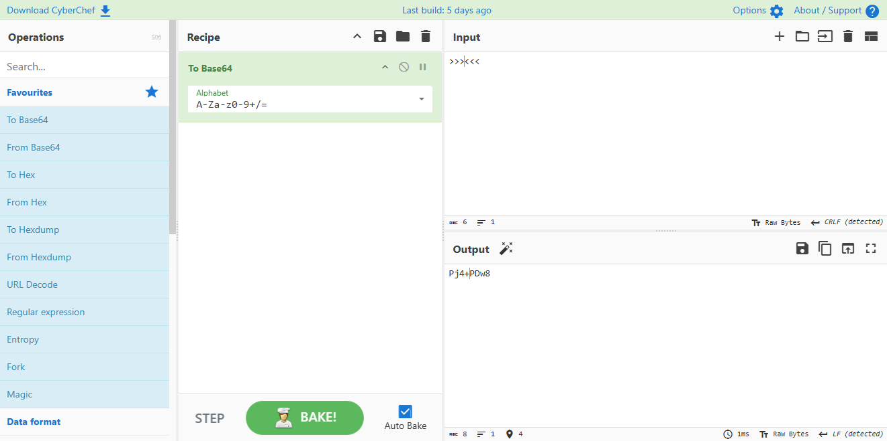

* **Teori & Penjelasan Singkat:**
    > Malware menggunakan protokol sederhana. String `>>>` berfungsi sebagai sinyal transisi antar beberapa file, sedangkan string `FIN` digunakan sebagai *acknowledgement* akhir bahwa seluruh rangkaian pengiriman file telah selesai dilakukan.

---

### **10. What is the killswitch sent by the listener to the malware if the finished status signal has been sent by the malware? (10 poin)**

* **Jawaban:** **`jangandalupatryhardctfcompit2025`**

* **Display Filter:** `frame.number == 38`

* **Langkah-Langkah Pengerjaan:**
    1. Cari paket balasan dari arah `172.31.66.144` ke `172.31.64.1` yang dikirimkan **setelah** malware mengirim sinyal `FIN` di Paket 36.
    2. Buka **Paket ke-38** pada Wireshark.
    3. Periksa panel **Packet Bytes** (ASCII) pada Paket 38.
    4. Temukan string *Base64* dengan balasan `amFuZ2FubHVwYXRyeWhhcmRjdGZjb21waXQyMDI1` yang jika didecode akan menjadi `jangandalupatryhardctfcompit2025`.

    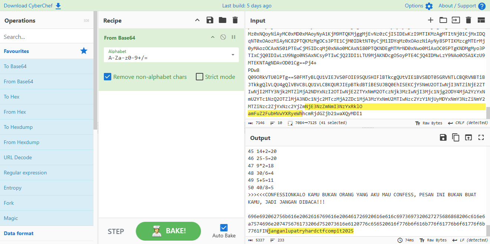

* **Teori & Penjelasan Singkat:**
    > Tepat setelah malware mengirimkan sinyal `FIN` pada Paket 24, *listener* merespons pada Paket 38 dengan mengirimkan string *Base64* `jangandalupatryhardctfcompit2025`. String ini bertindak sebagai *killswitch* atau perintah pemutus interaksi dari *listener* kepada malware.
